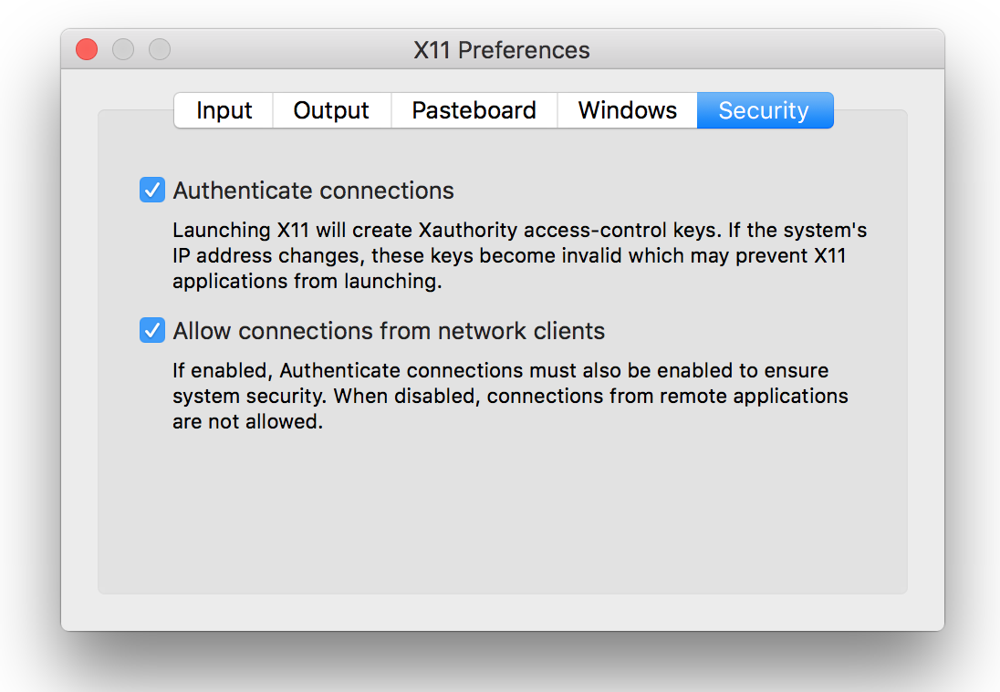

==========================
Running PyCBC under Docker
==========================

The easiest way to start using PyCBC is to install one of our `Docker containers <https://hub.docker.com/u/pycbc/>`_. First, install the `Docker Community Edition <https://www.docker.com/community-edition>`_ for your `Mac <https://store.docker.com/editions/community/docker-ce-desktop-mac?tab=description>`_ or `Windows <https://store.docker.com/editions/community/docker-ce-desktop-windows?tab=description>`_ desktop. Docker CE installations for `Linux platforms <https://www.docker.com/community-edition#/download>`_ are also available.

To start a Docker container with no graphics, type the commands::

    docker pull pycbc/pycbc-el7:latest
    docker run -it pycbc/pycbc-el7:latest /bin/bash -l

This example downloads current version of the code from the `GitHub master branch. <https://github.com/ligo-cbc/pycbc>`_ Replace the string ``latest`` with one of the `PyCBC release tags <https://github.com/ligo-cbc/pycbc/releases>`_ (e.g. ``v1.7.0``) to install a container containing a released version of PyCBC. The container includes all of the required software and dependencies to run PyCBC, including a compatible version of LALSuite.

--------------------
Graphics on Mac OS X
--------------------

To start a Docker container on Mac OS X that can display graphics on Mac OS X, you must be running `XQuartz <https://www.xquartz.org/>`_ version 2.7.11 or higher. To start an X11 server, run the command::

    open -a Xquartz

In the Xquartz preferences, make sure that ``Allow connections from network clients`` is checked, as shown below:

Next, enable Docker to connect to your X11 server by running the commands::

    ip=$(ifconfig en0 | grep inet | awk '$1=="inet" {print $2}')
    xhost + $ip

Finally, start the Docker container with::

    docker run -e DISPLAY=${ip}:0 -it pycbc/pycbc-el7:latest /bin/bash -l

-----------------
Graphics on Linux
-----------------

To start a Docker container on Linux that can display graphics, run the commands::

    docker run -e DISPLAY=${DISPLAY} -v /tmp/.X11-unix:/tmp/.X11-unix/ -it pycbc/pycbc-el7:latest /bin/bash -l

If you are having problems with this method, try `Using ssh to display graphics`_.

-------------------------------
Sharing user files and SSH keys
-------------------------------

It can be useful to share your SSH public/private key with the Docker container, for example to allow you to git push and pull from your repository on GitHub. To do this, add the argument ``-v ${HOME}/.ssh:/home/pycbc/.ssh`` to the ``docker run`` commands.  You can also create e.g. a ``scratch`` directory and use the ``-v`` option to mount it in the container. This directory can be used to transfer files between the container and the host computer.  The command below will start a Docker container with graphics on a Mac and share ssh keys and a ``scratch`` directory::

    mkdir -p scratch
    docker run -e DISPLAY=$(ifconfig en0 | grep inet | awk '$1=="inet" {print $2}'):0 -v `pwd`/scratch:/home/pycbc/scratch -v ${HOME}/.ssh:/home/pycbc/.ssh -it pycbc/pycbc-el7:latest /bin/bash -l

-----------------------------
Using SSH to display graphics
-----------------------------

If you do not have a recent version of Xquartz, or you are encountering other X11 issues, another way to run a docker container with graphics is to start a container that runs an SSH daemon and connect to that. This is also useful for trabsfering files to and from the Docker container using ``scp`` from your host computer.

If do not already have a personal ssh public/private key, first create one with the command::

    ssh-keygen -t rsa
    cat ~/.ssh/id_rsa.pub >> ~/.ssh/authorized_keys
    chmod 600 ~/.ssh/authorized_keys

Now start the docker container with::

    docker run --name pycbc -d -P -v ${HOME}/.ssh:/home/pycbc/.ssh -t pycbc/pycbc-el7 tail -f /dev/null i   
    docker exec -u root -it pycbc /usr/bin/pycbc-sshd

And then you can connect to it with the command::

    ssh -Y pycbc@127.0.0.1 -p `docker port pycbc 22 | awk -F: '{print $NF}'`

