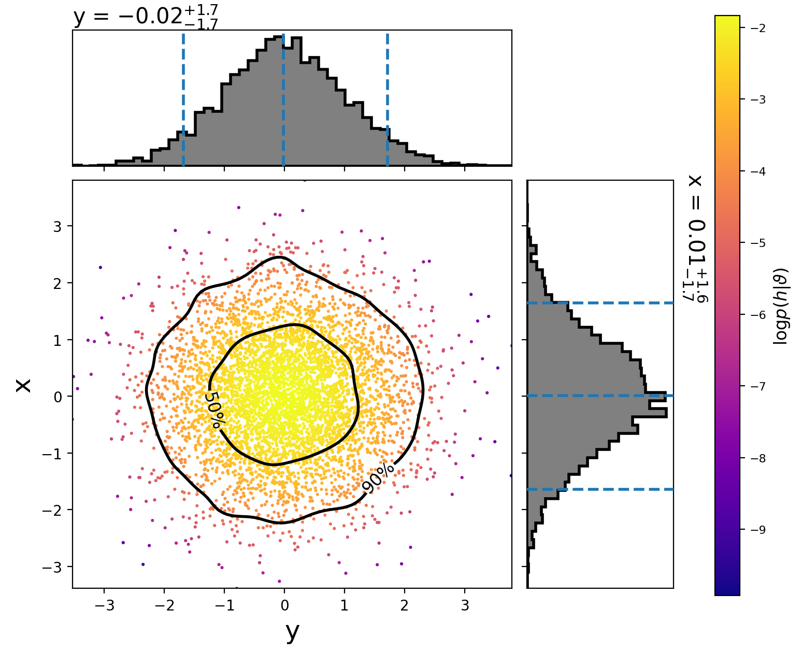

###################################################################
PyCBC inference documentation (``pycbc.inference``)
###################################################################

===================
Introduction
===================

This page gives details on how to use the various parameter estimation
executables and modules available in PyCBC. The ``pycbc.inference`` subpackage
contains classes and functions for evaluating probability distributions,
likelihoods, and running Bayesian samplers.

==================================================
Sampling the parameter space (``pycbc_inference``)
==================================================

--------
Overview
--------

The executable ``pycbc_inference`` is designed to sample the parameter space
and save the samples in an HDF file. A high-level description of the
``pycbc_inference`` algorithm is

#. Read priors from a configuration file.

#. Setup the model to use. If the model uses data, then:

    * Read gravitational-wave strain from a gravitational-wave model or use
      recolored fake strain.

    * Estimate a PSD.

#. Run a sampler to estimate the posterior distribution of the model.

#. Write the samples and metadata to an HDF file.

The model, sampler, parameters to vary and their priors are specified in a
configuration file, which is passed to the program using the ``--config-file``
option. Other command-line options determine what data to load (if the model
uses data) and what parallelization settings to use. For a full listing of all
options run ``pycbc_inference --help``. Below, we give details on how
to set up a configuration file and provide examples of how to run
``pycbc_inference``.

------------------------------------------
Configuring the model, sampler, and priors
------------------------------------------

The configuration file uses :py:class:`WorkflowConfigParser
<pycbc.workflow.configuration.WorkflowConfigParser>` syntax.  The required
sections are: ``[model]``, ``[sampler]``, and ``[variable_params]``.  In
addition, multiple ``[prior]`` sections must be provided that define the prior
distribution to use for the parameters in ``[variable_params]``.

^^^^^^^^^^^^^^^^^^^^^
Configuring the model
^^^^^^^^^^^^^^^^^^^^^

The ``[model]`` section sets up what model to use for the analysis. At minimum,
a ``name`` argument must be provided, specifying which model to use. For
example:

.. code-block:: ini

   [model]
   name = gaussian_noise

In this case, the :py:class:`GaussianNoise <gwin.models.GaussianNoise>` would
be used.  (Examples of using this model on a BBH injection and on GW150914 are
given below.) Other arguments to configure the model may also be set in this
section.  The recognized arguments depend on the model. The currently available
models are:

.. include:: _include/models-table.rst

Refer to the models' ``from_config`` method to see what configuration arguments
are available.

Any model name that starts with ``test_`` is an analytic test distribution that
requires no data or waveform generation. See the section below on running on an
analytic distribution for more details.

^^^^^^^^^^^^^^^^^^^^^^^
Configuring the sampler
^^^^^^^^^^^^^^^^^^^^^^^

The ``[sampler]`` section sets up what sampler to use for the analysis. As
with the ``[model]`` section, a ``name`` must be provided to specify which
sampler to use. The currently available samplers are:

.. include:: _include/samplers-table.rst

Configuration options for the sampler should also be specified in the
``[sampler]`` section. For example:

.. code-block:: ini

   [sampler]
   name = emcee
   nwalkers = 5000
   niterations = 1000
   checkpoint-interval = 100

This would tell ``pycbc_inference`` to run the
:py:class:`EmceeEnsembleSampler <pycbc.inference.sampler.emcee.EmceeEnsembleSampler>`
with 5000 walkers for 1000 iterations, checkpointing every 100th iteration.
Refer to the samplers' ``from_config`` method to see what configuration options
are available.

Burn-in tests may also be configured for MCMC samplers in the config file. The
options for the burn-in should be placed in ``[sampler-burn_in]``. At minimum,
a ``burn-in-test`` argument must be given in this section. This argument
specifies which test(s) to apply. Multiple tests may be combined using standard
python logic operators. For example:

.. code-block:: ini

   [sampler-burn_in]
   burn-in-test = nacl & max_posterior

In this case, the sampler would be considered to be burned in when both the
``nacl`` *and* ``max_posterior`` tests were satisfied. Setting this to ``nacl |
max_postrior`` would instead consider the sampler to be burned in when either
the ``nacl`` *or* ``max_posterior`` tests were satisfied. For more information
on what tests are available, see the :py:mod:`pycbc.inference.burn_in` module.

^^^^^^^^^^^^^^^^^^^^^^^^^^^^
Thinning samples (MCMC only)
^^^^^^^^^^^^^^^^^^^^^^^^^^^^

The default behavior for the MCMC samplers (``emcee``, ``emcee_pt``) is to save
every iteration of the Markov chains to the output file. This can quickly lead
to very large files. For example, a BBH analysis (~15 parameters) with 200
walkers, 20 temperatures may take ~50 000 iterations to acquire ~5000
independent samples. This will lead to a file that is ~ 50 000 iterations x 200
walkers x 20 temperatures x 15 parameters x 8 bytes ~ 20GB.  Quieter signals
can take an order of magnitude more iterations to converge, leading to O(100GB)
files. Clearly, since we only obtain 5000 independent samples from such a run,
the vast majority of these samples are of little interest.

To prevent large file size growth, samples may be thinned before they are
written to disk. Two thinning options are available, both of which are set in
the ``[sampler]`` section of the configuration file. They are:

 * ``thin-interval``: This will thin the samples by the given integer before
   writing the samples to disk. File sizes can still grow unbounded, but at
   a slower rate. The interval must be less than the checkpoint interval.
 * ``max-samples-per-chain``: This will cap the maximum number of samples per
   walker and per temperature to the given integer. This ensures that file
   sizes never exceed ~ ``max-samples-per-chain`` x ``nwalkers`` x ``ntemps``
   x ``nparameters`` x 8 bytes. Once the limit is reached,
   samples will be thinned on disk, and new samples will be thinned to match.
   The thinning interval will grow with longer runs as a result. To ensure
   that enough samples exist to determine burn in and to measure an
   autocorrelation length, ``max-samples-per-chain`` must be greater than
   or equal to 100.

The thinned interval that was used for thinning samples is saved to the output
file's ``thinned_by`` attribute (stored in the HDF file's ``.attrs``).  Note
that this is not the autocorrelation length (ACL), which is the amount that the
samples need to be further thinned to obtain independent samples.

.. note::

    In the output file creates by the MCMC samplers, we adopt the convention
    that "iteration" means iteration of the sampler, not index of the samples.
    For example, if a burn in test is used, ``burn_in_iteration`` will be
    stored to the ``sampler_info`` group in the output file. This gives the
    iteration of the sampler at which burn in occurred, not the sample on disk.
    To determine  which samples an iteration corresponds to in the file, divide
    iteration by ``thinned_by``.

    Likewise, we adopt the convention that autocorrelation **length** (ACL) is
    the autocorrelation length of the thinned samples (the number of samples on
    disk that you need to skip to get independent samples) whereas
    autocorrelation **time** (ACT) is the autocorrelation length in terms of
    iteration (it is the number of **iterations** that you need to skip to get
    independent samples); i.e., ``ACT = thinned_by x ACL``. The ACT is (up to
    measurement resolution) independent of the thinning used, and thus is
    useful for comparing the performance of the sampler.

^^^^^^^^^^^^^^^^^^^^^
Configuring the prior
^^^^^^^^^^^^^^^^^^^^^

What parameters to vary to obtain a posterior distribution are determined by
``[variable_params]`` section. For example:

.. code-block:: ini

   [variable_params]
   x =
   y =

This would tell ``pycbc_inference`` to sample a posterior over two parameters
called ``x`` and ``y``.

A prior must be provided for every parameter in ``[variable_params]``. This
is done by adding sections named ``[prior-{param}]`` where ``{param}`` is the
name of the parameter the prior is for. For example, to provide a prior for the
``x`` parameter in the above example, you would need to add a section called
``[prior-x]``. If the prior couples more than one parameter together in a joint
distribution, the parameters should be provided as a ``+`` separated list,
e.g., ``[prior-x+y+z]``.

The prior sections specify what distribution to use for the parameter's prior,
along with any settings for that distribution.  Similar to the ``model`` and
``sampler`` sections, each ``prior`` section must have a ``name`` argument that
identifies the distribution to use. Distributions are defined in the
:py:mod:`pycbc.distributions` module. The currently available distributions
are:

.. include:: _include/distributions-table.rst

^^^^^^^^^^^^^^^^^
Static parameters
^^^^^^^^^^^^^^^^^

A ``[static_params]`` section may be provided to list any parameters that
will remain fixed throughout the run. For example:

.. code-block:: ini

   [static_params]
   approximant = IMRPhenomPv2
   f_lower = 18

-------------------------------
Advanced configuration settings
-------------------------------

The following are additional settings that may be provided in the configuration
file, in order to do more sophisticated analyses.

^^^^^^^^^^^^^^^^^^^
Sampling transforms
^^^^^^^^^^^^^^^^^^^

One or more of the ``variable_params`` may be transformed to a different
parameter space for purposes of sampling. This is done by specifying a
``[sampling_params]`` section. This section specifies which
``variable_params`` to replace with which parameters for sampling. This must be
followed by one or more ``[sampling_transforms-{sampling_params}]`` sections
that provide the transform class to use. For example, the following would cause
the sampler to sample in chirp mass (``mchirp``) and mass ratio (``q``) instead
of ``mass1`` and ``mass2``:

.. code-block:: ini

   [sampling_params]
   mass1, mass2: mchirp, q

   [sampling_transforms-mchirp+q]
   name = mass1_mass2_to_mchirp_q

Transforms are provided by the :py:mod:`pycbc.transforms` module. The currently
available transforms are:

.. include:: _include/transforms-table.rst

.. note::
   Both a ``jacobian`` and ``inverse_jacobian`` must be defined in order to use
   a transform class for a sampling transform. Not all transform classes in
   :py:mod:`pycbc.transforms` have these defined. Check the class
   documentation to see if a Jacobian is defined.

^^^^^^^^^^^^^^^^^^^
Waveform transforms
^^^^^^^^^^^^^^^^^^^

There can be any number of ``variable_params`` with any name. No parameter name
is special (with the exception of parameters that start with ``calib_``; see
below).

However, when doing parameter estimation with CBC waveforms, certain parameter
names must be provided for waveform generation. The parameter names recognized
by the CBC waveform generators are:

.. include:: _include/waveform-parameters.rst

It is possible to specify a ``variable_param`` that is not one of these
parameters. To do so, you must provide one or more
``[waveforms_transforms-{param}]`` section(s) that define transform(s) from the
arbitrary ``variable_params`` to the needed waveform parameter(s) ``{param}``.
For example, in the following we provide a prior on ``chirp_distance``. Since
``distance``, not ``chirp_distance``, is recognized by the CBC waveforms
module, we provide a transform to go from ``chirp_distance`` to ``distance``:

.. code-block:: ini

   [variable_params]
   chirp_distance =

   [prior-chirp_distance]
   name = uniform
   min-chirp_distance = 1
   max-chirp_distance = 200

   [waveform_transforms-distance]
   name = chirp_distance_to_distance

A useful transform for these purposes is the
:py:class:`CustomTransform <pycbc.transforms.CustomTransform>`, which allows
for arbitrary transforms using any function in the :py:mod:`pycbc.conversions`,
:py:mod:`pycbc.coordinates`, or :py:mod:`pycbc.cosmology` modules, along with
numpy math functions. For example, the following would use the I-Love-Q
relationship :py:meth:`pycbc.conversions.dquadmon_from_lambda` to relate the
quadrupole moment of a neutron star ``dquad_mon1`` to its tidal deformation
``lambda1``:

.. code-block:: ini

   [variable_params]
   lambda1 =

   [waveform_transforms-dquad_mon1]
   name = custom
   inputs = lambda1
   dquad_mon1 = dquadmon_from_lambda(lambda1)

.. note::
   A Jacobian is not necessary for waveform transforms, since the transforms
   are only being used to convert a set of parameters into something that the
   waveform generator understands. This is why in the above example we are
   able to use a custom transform without needing to provide a Jacobian.

Some common transforms are pre-defined in the code. These are: the mass
parameters ``mass1`` and ``mass2`` can be substituted with ``mchirp`` and
``eta`` or ``mchirp`` and ``q``.  The component spin parameters ``spin1x``,
``spin1y``, and ``spin1z`` can be substituted for polar coordinates
``spin1_a``, ``spin1_azimuthal``, and ``spin1_polar`` (ditto for ``spin2``).

^^^^^^^^^^^^^^^^^^^^^^
Calibration parameters
^^^^^^^^^^^^^^^^^^^^^^

If any calibration parameters are used (prefix ``calib_``), a ``[calibration]``
section must be included. This section must have a ``name`` option that
identifies what calibration model to use. The models are described in
:py:mod:`pycbc.calibration`. The ``[calibration]`` section must also include
reference values ``fc0``, ``fs0``, and ``qinv0``, as well as paths to ASCII
transfer function files for the test mass actuation, penultimate mass
actuation, sensing function, and digital filter for each IFO being used in the
analysis. E.g. for an analysis using H1 only, the required options would be
``h1-fc0``, ``h1-fs0``, ``h1-qinv0``, ``h1-transfer-function-a-tst``,
``h1-transfer-function-a-pu``, ``h1-transfer-function-c``,
``h1-transfer-function-d``.

^^^^^^^^^^^
Constraints
^^^^^^^^^^^

One or more constraints may be applied to the parameters; these are
specified by the ``[constraint]`` section(s). Additional constraints may be
supplied by adding more ``[constraint-{tag}]`` sections. Any tag may be used; the
only requirement is that they be unique. If multiple constraint sections are
provided, the union of all constraints is applied. Alternatively, multiple
constraints may be joined in a single argument using numpy's logical operators.

The parameter that constraints are applied to may be any parameter in
``variable_params`` or any output parameter of the transforms. Functions may be
applied to these parameters to obtain constraints on derived parameters. Any
function in the conversions, coordinates, or cosmology module may be used,
along with any numpy ufunc. So, in the following example, the mass ratio (q) is
constrained to be <= 4 by using a function from the conversions module.

.. code-block:: ini

   [variable_params]
   mass1 =
   mass2 =

   [prior-mass1]
   name = uniform
   min-mass1 = 3
   max-mass1 = 12

   [prior-mass2]
   name = uniform
   min-mass2 = 1
   min-mass2 = 3

   [constraint-1]
   name = custom
   constraint_args = q_from_mass1_mass2(mass1, mass2) <= 4

------------------------------
Checkpointing and output files
------------------------------

While ``pycbc_inference`` is running it will create a checkpoint file which
is named ``{output-file}.checkpoint``, where ``{output-file}`` was the name
of the file you specified with the ``--output-file`` command. When it
checkpoints it will dump results to this file; when finished, the file is
renamed to ``{output-file}``. A ``{output-file}.bkup`` is also created, which
is a copy of the checkpoint file. This is kept in case the checkpoint file gets
corrupted during writing. The ``.bkup`` file is deleted at the end of the run,
unless ``--save-backup`` is turned on.

When ``pycbc_inference`` starts, it checks if either
``{output-file}.checkpoint`` or ``{output-file}.bkup`` exist (in that order).
If at least one of them exists, ``pycbc_inference`` will attempt to load them
and continue to run from the last checkpoint state they were in.

The output/checkpoint file are HDF files. To peruse the structure of the file
you can use the `h5ls` command-line utility. More advanced utilities for
reading and writing from/to them are provided by the sampler IO classes in
:py:mod:`pycbc.inference.io`. To load one of these files in python do:

.. code-block:: python

   from pycbc.inference import io
   fp = io.loadfile(filename, "r")

Here, ``fp`` is an instance of a sampler IO class. Basically, this is an
instance of an :py:mod:`h5py.File <h5py:File>` handler, with additional
convenience functions added on top. For example, if you want all of the samples
of all of the variable parameters in the file, you can do:

.. code-block:: python

   samples = fp.read_samples(fp.variable_params)

This will return a :py:class:`FieldArray <pycbc.io.record.FieldArray>` of all
of the samples.

Each sampler has it's own sampler IO class that adds different convenience
functions, depending on the sampler that was used. For more details on these
classes, see the :py:mod:`pycbc.inference.io` module.

========
Examples
========

Examples are given in the subsections below.

-----------------------------------
Running on an analytic distribution
-----------------------------------

Several analytic distributions are available to run tests on. These can be run
quickly on a laptop to check that a sampler is working properly.

This example demonstrates how to sample a 2D normal distribution with the
``emcee`` sampler. First, we create the following configuration file:

.. literalinclude:: ../examples/inference/analytic-normal2d/normal2d.ini
   :language: ini

:download:`Download <../examples/inference/analytic-normal2d/normal2d.ini>`

By setting the model name to ``test_normal`` we are using
:py:class:`TestNormal <pycbc.inference.models.analytic.TestNormal>`.
The number of dimensions of the distribution is set by the number of
``variable_params``. The names of the parameters do not matter, just that just
that the prior sections use the same names.

Now run:

.. literalinclude:: ../examples/inference/analytic-normal2d/run.sh
   :language: bash

:download:`Download <../examples/inference/analytic-normal2d/run.sh>`

This will run the ``emcee`` sampler on the 2D analytic normal distribution with
5000 walkers for 100 iterations. When it is done, you will have a file called
``normal2d.hdf`` which contains the results. It should take about a minute to
run. If you have a computer with more cores, you can increase the
parallelization by changing the ``nprocesses`` argument.

To plot the posterior distribution after the last iteration, run:

.. literalinclude:: ../examples/inference/analytic-normal2d/plot.sh
   :language: bash

:download:`Download <../examples/inference/analytic-normal2d/plot.sh>`

This will create the following plot:

The scatter points show each walker's position after the last iteration. The
points are colored by the log likelihood at that point, with the 50th and 90th
percentile contours drawn.

See below for more information about using ``pycbc_inference_plot_posterior``.

To make a movie showing how the walkers evolved, run:

.. literalinclude:: ../examples/inference/analytic-normal2d/make_movie.sh
   :language: bash

:download:`Download <../examples/inference/analytic-normal2d/make_movie.sh>`

.. note::
   You need ``ffmpeg`` installed for the mp4 to be created.

See below for more information on using ``pycbc_inference_plot_movie``.

---------------------
Simulated BBH example
---------------------

This example recovers the parameters of a simulated binary black-hole (BBH).

First, we need to create an ``injection.hdf`` file that specifies the
parameters of the simulated signal. To do that we will use
``pycbc_create_injection``. Like ``pycbc_inference``,
``pycbc_create_injections`` uses a configuration file to set the parameters of
the injections it will create. To create a binary-black hole with parameters
similar to GW150914, use the following configuration file:

.. literalinclude:: ../examples/inference/bbh-injection/injection.ini
   :language: ini

:download:`Download <../examples/inference/bbh-injection/injection.ini>`

Note the similarity to the configuration file for ``pycbc_inference``: you must
have a ``[variable_params]`` section. If we wanted to randomize one or more
of the parameters, we would list them there, then add ``[prior]`` sections to
specify what distribution to draw the parameters from. In this case, however,
we want to fix the parameters, so we just put all of the necessary parameters
in the ``[static_params]`` section.

To create the injection file, run:

.. literalinclude:: ../examples/inference/bbh-injection/make_injection.sh
   :language: bash

:download:`Download <../examples/inference/bbh-injection/make_injection.sh>`

This will create the ``injection.hdf`` file, which we will give to
``pycbc_inference``. For more information on generating injection files, run
``pycbc_create_injections --help``.

Now we need to create the configuration file for ``pycbc_inference``, calling
it ``inference.ini``:

.. literalinclude:: ../examples/inference/bbh-injection/inference.ini
   :language: ini

:download:`Download <../examples/inference/bbh-injection/inference.ini>`

Here, we will use the ``emcee_pt`` sampler with 200 walkers and 20
temperatures. We will checkpoint (i.e., dump results to file) every 2000
iterations. Since we have provided an ``effective-nsamples`` argument and
a ``[sampler-burn_in]`` section, ``pycbc_inference`` will run until it has
acquired 1000 independent samples after burn-in, which is determined by the
:py:meth:`nacl <pycbc.inference.burn_in.MultiTemperedMCMCBurnInTests.nacl>`
test.

The number of independent samples is checked at each checkpoint: after dumping
the results, the burn-in test is applied and an autocorrelation length is
calculated. The number of independent samples is then
``nwalkers x (the number of iterations since burn in)/ACL``. If this number
exceeds ``effective-nsamples``, ``pycbc_inference`` will finalize the results
and exit.

Now run:

.. literalinclude:: ../examples/inference/bbh-injection/run.sh
   :language: bash

:download:`Download <../examples/inference/bbh-injection/run.sh>`

Note that now we must provide for data. In this case, we are generating fake
Gaussian noise (via the ``fake-strain``) module that is colored by the
advanced LIGO zero detuned high power PSD. We also have to provide arguments
for estimating a PSD.

The duration of data that will be analyzed is set by the
``gps-(start|end)-time`` arguments. This data should be long enough such that
it encompasses the longest waveform admitted by our prior, plus our timing
uncertainty (which is determined by the prior on ``tc``). Waveform duration is
approximately determined by the total mass of a system. The lowest total mass
(`= mass1 + mass2`) admitted by our prior is 20 solar masses. This corresponds
to a duration of approximately 6 seconds. (See the :py:mod:`pycbc.waveform`
module for utilities to estimate waveform duration.)

In addition, the beginning and end of the data segment will be corrupted by the
convolution of the inverse PSD with the data. To limit the amount of time that
is corrupted, we set ``--psd-inverse-length`` to ``4``. This limits the
corruption to at most the first and last four seconds of the data segment.

Combining these considerations, we end up creating 16 seconds of data: 8s for
the waveform (we added a 2s safety buffer) + 4s at the beginning and end for
inverse PSD corruption.

Since we are generating waveforms and analyzing a 15 dimensional parameter
space, this run will be much more computationally expensive than the analytic
example above. We recommend running this on a cluster or a computer with a
large number of cores. In the example, we have set the parallelization to use
10 cores. With these settings, it should checkpoint approximately every hour or
two. The run should complete in a few hours. If you would like to acquire more
samples, increase ``effective-nsamples``.

----------------
GW150914 example
----------------

To run on GW150914, we can use the same configuration file as was used for the
BBH example, above.
(:download:`Download <../examples/inference/gw150914/inference.ini>`)

Now you need to obtain the real LIGO data containing GW150914. Do one of
the following:

* **If you are a LIGO member and are running on a LIGO Data Grid cluster:**
  you can use the LIGO data server to automatically obtain the frame files.
  Simply set the following environment variables:

  .. code-block:: bash

     export FRAMES="--frame-type H1:H1_HOFT_C02 L1:L1_HOFT_C02"
     export CHANNELS="H1:H1:DCS-CALIB_STRAIN_C02 L1:L1:DCS-CALIB_STRAIN_C02"

* **If you are not a LIGO member, or are not running on a LIGO Data Grid
  cluster:** you need to obtain the data from the
  `Gravitational Wave Open Science Center <https://www.gw-openscience.org>`_.
  First run the following commands to download the needed frame files to your
  working directory:

  .. code-block:: bash

     wget https://www.gw-openscience.org/catalog/GWTC-1-confident/data/GW150914/H-H1_GWOSC_4KHZ_R1-1126257415-4096.gwf
     wget https://www.gw-openscience.org/catalog/GWTC-1-confident/data/GW150914/L-L1_GWOSC_4KHZ_R1-1126257415-4096.gwf

  Then set the following enviornment variables:

  .. code-block:: bash

     export FRAMES="--frame-files H1:H-H1_GWOSC_4KHZ_R1-1126257415-4096.gwf L1:L-L1_GWOSC_4KHZ_R1-1126257415-4096.gwf"
     export CHANNELS="H1:GWOSC-4KHZ_R1_STRAIN L1:GWOSC-4KHZ_R1_STRAIN"

Now run:

.. literalinclude:: ../examples/inference/gw150914/run.sh
   :language: bash

:download:`Download <../examples/inference/gw150914/run.sh>`

===============================================
Visualizing the Posteriors
===============================================

.. toctree::
   :maxdepth: 1

   inference/viz.rst

===============================================
Workflows
===============================================

.. toctree::
   :maxdepth: 1

   workflow/pycbc_make_inference_workflow
   workflow/pycbc_make_inference_inj_workflow

===============================================
For Developers
===============================================

.. toctree::
    :maxdepth: 1

    inference/sampler_api.rst
    inference/io.rst
